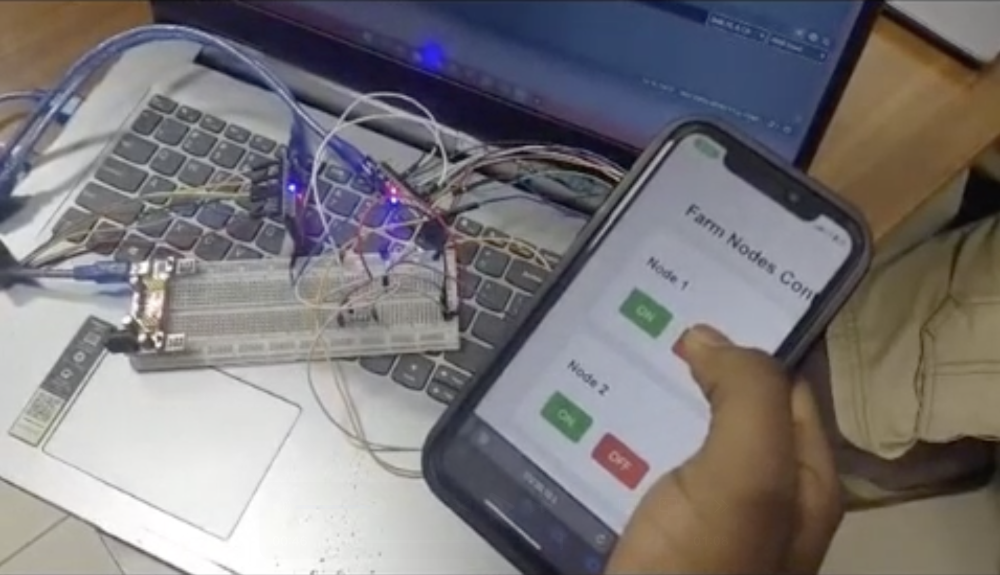

# ML Poultry Farm IoT System



> IoT-based poultry farm monitoring and intelligent heater control — combining a multi-node wireless sensor network with an on-device TinyML model for automated climate management.

---

## Overview

Maintaining optimal temperature and humidity in a poultry farm is critical for livestock health and productivity. This system automates that process end-to-end: distributed sensor nodes collect environmental data, an ESP32 gateway aggregates and publishes it over MQTT, a database archives all readings, and a trained TensorFlow Lite model predicts whether the heater should activate — all controllable through a web interface.

The ML model is exported as both `.tflite` and a C header (`.h`), making it directly deployable on microcontrollers without a full Python runtime.

---

## System Architecture

```
┌─────────────────────────────────────────────────────────────────┐
│                        Poultry Farm                             │
│                                                                 │
│  ┌──────────────┐    nRF24L     ┌──────────────────────────┐   │
│  │  Field Node  │ ────────────► │   ESP32 Gateway          │   │
│  │  (Sensor +   │               │   (IoTReceiver_PartB)    │   │
│  │   nRF24L)    │               │   • Aggregates readings  │   │
│  └──────────────┘               │   • Publishes via MQTT   │   │
│  ┌──────────────┐    nRF24L     └────────────┬─────────────┘   │
│  │  Field Node  │ ────────────►              │                  │
│  └──────────────┘                            │                  │
└─────────────────────────────────────────────┼─────────────────┘
                                               │ MQTT
                              ┌────────────────▼──────────────┐
                              │      Backend Server            │
                              │      (iot_farm.py)             │
                              │  • MQTT subscriber             │
                              │  • Database archiving          │
                              │  • Web control interface       │
                              │  • ML inference (TFLite)       │
                              └───────────────────────────────┘
```

---

## Features

| Feature | Description |
|---|---|
| **Multi-node sensor network** | Multiple field nodes transmit temperature, humidity, and light readings wirelessly via nRF24L radios |
| **ESP32 MQTT gateway** | Receives sensor data over nRF24L and publishes to an MQTT broker for downstream processing |
| **Database archiving** | All sensor readings are stored persistently for historical analysis and review |
| **TinyML heater prediction** | A trained ML model predicts heater ON/OFF state from environmental inputs — deployable on MCU |
| **MCU-ready model export** | Model exported as `.tflite` and `.h` (C header array) for direct embedding in firmware |
| **Web control interface** | Browser-based dashboard for monitoring live readings and controlling field devices |

---

## ML Model

The heater prediction model is trained in `poultry_heater_ml_IOT.ipynb` using sensor data collected from the farm network.

**Inputs:**
- Temperature (°C)
- Humidity (%)
- Light level (lux / ADC value)

**Output:**
- Heater activation prediction: `ON` / `OFF` (binary classification)

**Deployment formats:**
- `poultry_heater_model.tflite` — for inference via TensorFlow Lite runtime
- `poultry_heater_model.h` — C header array for direct inclusion in Arduino / ESP32 / STM32 firmware

---

## Repository Structure

```
ML-poultry-farm-IOT-system/
│
├── field_node/                      # Firmware for sensor nodes (C/C++)
│                                    # Reads DHT + light sensors, transmits via nRF24L
│
├── IoTReceiver_PartB/               # ESP32 gateway firmware (C/C++)
│                                    # Receives nRF24L packets, publishes over MQTT
│
├── iot_project_final1/              # Supporting project files / integration code
│
├── database_dump/                   # Exported database records / sample data
│
├── iot_farm.py                      # Backend server: MQTT subscriber, DB archiving,
│                                    # ML inference, web interface
│
├── poultry_heater_ml_IOT.ipynb      # ML training notebook (data prep, model training,
│                                    # evaluation, TFLite export)
│
├── poultry_heater_model.tflite      # Trained TFLite model (runtime inference)
├── poultry_heater_model.h           # Trained model as C header (MCU deployment)
│
├── schematic_iot.pdf                # Full hardware wiring schematic
├── WhatsApp Video 2025-12-15 ...mp4 # Live system demo video
└── LICENSE
```

---

## Hardware

| Component | Role |
|---|---|
| Arduino / AVR microcontroller | Field node — reads sensors, transmits via nRF24L |
| nRF24L radio modules | Wireless communication between field nodes and gateway |
| DHT sensor (DHT11 / DHT22) | Temperature and humidity sensing at each node |
| Light sensor (LDR / photodiode) | Ambient light level sensing |
| ESP32 | Gateway — receives nRF24L data, connects to Wi-Fi, publishes MQTT |
| Heater / relay | Controlled output based on ML prediction |

### Schematic


> Full wiring and pin assignment diagram. Also available as `schematic_iot.pdf` in the repository root.

---

## Getting Started

### Prerequisites

**Hardware firmware (field nodes + ESP32 gateway):**
- Arduino IDE or PlatformIO
- Required libraries: `RF24`, `DHT sensor library`, `PubSubClient` (MQTT)

**Backend & ML:**
- Python 3.8+
- `pip install tensorflow paho-mqtt flask`
- MQTT broker (e.g., Mosquitto — local or cloud)

### 1. Flash the Field Nodes

Open `field_node/` in Arduino IDE, configure your sensor pins, and flash to each node board.

### 2. Flash the ESP32 Gateway

Open `IoTReceiver_PartB/` in Arduino IDE. Update the Wi-Fi credentials and MQTT broker address in the config, then flash to the ESP32.

### 3. Run the Backend Server

```bash
python iot_farm.py
```

This starts the MQTT subscriber, begins archiving readings to the database, runs ML inference on incoming data, and serves the web control interface.

### 4. Open the Web Interface

Navigate to `http://localhost:<port>` in your browser to view live sensor data and control the heater.

### 5. Retrain the Model (Optional)

Open and run `poultry_heater_ml_IOT.ipynb` in Jupyter to retrain on new data and re-export updated `.tflite` and `.h` files.

---

## Demo

A live demonstration video (`WhatsApp Video 2025-12-15 at 23.40.22.mp4`) is included in the repository showing the full system in operation.

---

## License

This project is licensed under the **MIT License** — see the [LICENSE](LICENSE) file for details.

---

## Author

**Shadrack Agyei Nti**  
Computer Engineering · Ashesi University · 2026  
[GitHub](https://github.com/ShadrackAgyei) · shadrack.nti@ashesi.edu.gh
